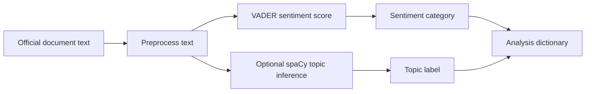

# Sentiment Analyzer

Analyzing sentiment in official documents can help track policy direction, institutional positioning, and changes in public communication over time.

This repository is a compact NLP notebook that combines topic inference with VADER sentiment scoring for policy-style text.

## What It Does

- Loads NLP dependencies for notebook use.
- Uses NLTK VADER to compute a compound sentiment score.
- Maps the compound score into readable sentiment categories.
- Attempts topic inference with spaCy when `en_core_web_lg` is available.
- Falls back gracefully when optional spaCy resources are missing.

## Pipeline



## Reproduce

Install the core dependencies:

```bash
python -m pip install nltk spacy jupyter
python validate_nltk.py
```

Optional topic inference:

```bash
python -m spacy download en_core_web_lg
```

Then open `SentimentTrial.ipynb` and run the notebook.

## Status and Limitations

This is an exploratory analysis notebook, not a validated sentiment classifier for legal, financial, or governmental decision-making. VADER is a useful baseline, but official documents often use domain-specific language that can require a fine-tuned transformer model and labelled evaluation data.

Good next steps:

- Add a small labelled evaluation set.
- Compare VADER against a transformer baseline.
- Export the notebook workflow into a scriptable CLI.
- Save example inputs and outputs for repeatable review.

Interested in this area? Email me at praneeth.suresh.s@gmail.com.
